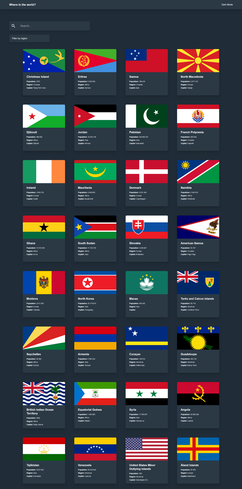
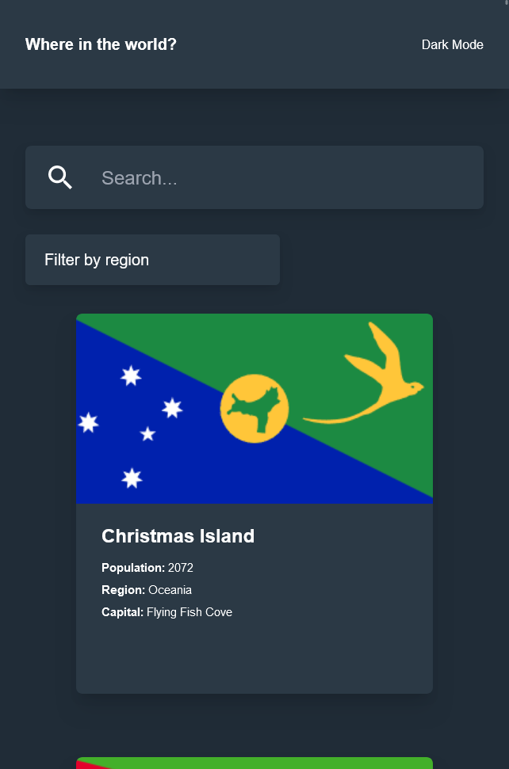
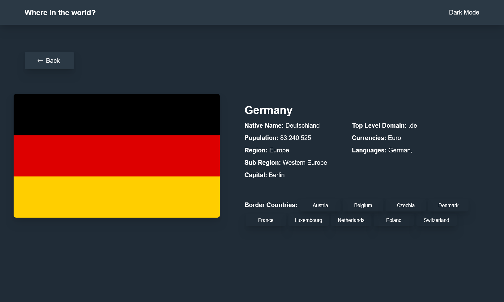
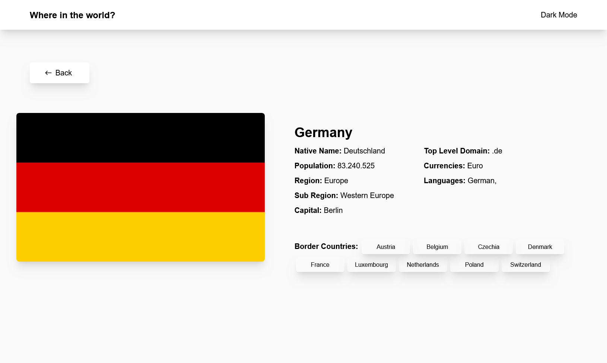

## Table of contents

- [Overview](#overview)
  - [The challenge](#the-challenge)
  - [Screenshot](#screenshot)
  - [Links](#links)
  - [Built with](#built-with)
  - [What I learned](#what-i-learned)
- [Author](#author)

## Overview

### The challenge

Users should be able to:

- See all countries from the API on the homepage
- Search for a country using an `input` field
- Filter countries by region
- Click on a country to see more detailed information on a separate page
- Click through to the border countries on the detail page
- Toggle the color scheme between light and dark mode

### Screenshot

### Links

##Future##

### Built with

- Semantic HTML5 markup
- Tailwind CSS
- Flexbox
- Mobile-first workflow
- [React](https://reactjs.org/) - JS library
- [Next.js](https://nextjs.org/) - React framework
- [TailWindCSS](https://tailwindcss.com) - CSS framework

### What I learned

Thanks to this project, I've acquired a understanding of REST APIs work, which has been an enlightening experience. Additionally, I've fine-tuned my proficiency in Tailwind CSS, concentrating on perfecting my responsive web design skills. Alongside these advancements, I've dedicated time to learning more about React.

## Author

- Website - [Maciej Kowalczyk]()
